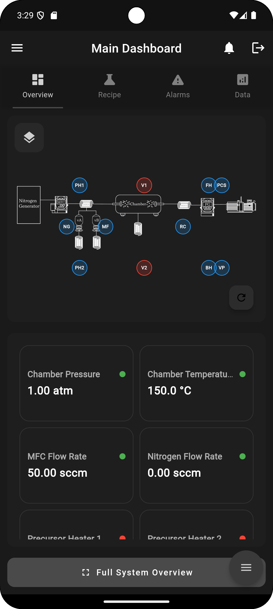

# ALD Machine Control and Maintenance System

## Overview

Welcome to the ALD Machine Control and Maintenance System, a comprehensive Flutter-based application designed to provide advanced control, monitoring, and maintenance capabilities for Atomic Layer Deposition (ALD) machines. This system combines real-time process control with preventive maintenance features to ensure optimal performance and longevity of your ALD equipment.

# 

## Key Features

### System Operation
- **Real-time Process Monitoring**: Track critical parameters such as chamber pressure, temperature, and gas flow rates
- **Recipe Management**: Create, edit, and execute ALD recipes with precise control over process parameters
- **Component Control**: Individual control of system components including valves, heaters, and mass flow controllers
- **Safety Monitoring**: Continuous monitoring of system parameters with automated safety checks and alerts

### Maintenance Management
- **Preventive Maintenance Scheduling**: Plan and track maintenance activities for all system components
- **Calibration Management**: Schedule and record calibration procedures with detailed history tracking
- **Spare Parts Inventory**: Track spare part inventory levels with automated low-stock alerts
- **Documentation Library**: Access to component manuals, maintenance procedures, and safety guidelines

### Administrative Features
- **User Management**: Role-based access control with admin, engineer, and operator levels
- **Reporting Tools**: Generate detailed reports on system performance, maintenance history, and calibration records
- **Remote Assistance**: Built-in support for remote troubleshooting and maintenance guidance

## Getting Started

### Prerequisites
- Flutter SDK (latest stable version)
- Firebase account and project setup
- Dart SDK version: 3.0.0 or higher
- Android Studio or VS Code with Flutter plugins

### Installation

1. Clone the repository:
```bash
git clone https://github.com/your-username/ald-machine-control.git
cd ald-machine-control
```

2. Install dependencies:
```bash
flutter pub get
```

3. Configure Firebase:
   - Create a new Firebase project
   - Download and add your `google-services.json` (Android) and `GoogleService-Info.plist` (iOS)
   - Enable Authentication and Firestore in your Firebase console

4. Run the application:
```bash
flutter run
```

### Initial Setup

1. **Admin Account Creation**:
   - First user to register is automatically assigned admin privileges
   - Admin can approve new user registrations and assign roles

2. **System Configuration**:
   - Configure component parameters and safety thresholds
   - Set up maintenance schedules and calibration intervals
   - Import existing recipes and procedures

## Project Structure

```
lib/
├── modules/
│   ├── system_operation/           # Core system operation functionality
│   ├── maintenance/                # Maintenance and calibration features
│   └── admin/                      # Administrative tools
├── models/                         # Data models
├── providers/                      # State management
├── repositories/                   # Data access layer
├── screens/                        # UI screens
├── services/                       # Business logic
├── utils/                         # Utility functions
└── widgets/                       # Reusable UI components
```

## Architecture and Design

### State Management
- Provider pattern for reactive state management
- Bloc pattern for complex state flows
- Repository pattern for data access

### Security
- Role-based access control (RBAC)
- Secure Firebase authentication
- Real-time data validation and sanitization

### Database Schema
- Firestore collections for:
  - User profiles and permissions
  - System components and parameters
  - Maintenance records
  - Calibration history
  - Recipes and procedures

## Contributing

We welcome contributions to improve the ALD Machine Control and Maintenance System. Please follow these steps:

1. Fork the repository
2. Create a feature branch (`git checkout -b feature/AmazingFeature`)
3. Commit your changes (`git commit -m 'Add some AmazingFeature'`)
4. Push to the branch (`git push origin feature/AmazingFeature`)
5. Open a Pull Request

### Coding Standards
- Follow Flutter's official style guide
- Maintain consistent documentation
- Write unit tests for new features
- Ensure backward compatibility

## Testing

```bash
# Run all tests
flutter test

# Run tests with coverage
flutter test --coverage
```

## Deployment

### Production Build
```bash
# Android
flutter build apk --release

# iOS
flutter build ios --release
```

### Environment Configuration
- Configure environment variables in `env.dart`
- Set up Firebase projects for development and production
- Update security rules in Firebase console

## Support and Maintenance

### Troubleshooting
- Check the troubleshooting guide in the docs folder
- Review Firebase logs for backend issues
- Verify network connectivity for real-time features

### Known Issues
- See the Issues tab on GitHub for current bugs and feature requests
- Check the changelog for recent updates and fixes

## License

This project is licensed under the MIT License - see the LICENSE.md file for details.

## Acknowledgments

- Flutter and Firebase teams for excellent documentation
- Contributors and maintainers
- ALD industry experts for domain knowledge

## Contact

For support or queries:
- Email: albaraazain33@gmail.com
- Issue Tracker: GitHub Issues
- Documentation: [Project Wiki](https://github.com/your-username/ald-machine-control/wiki)

---
